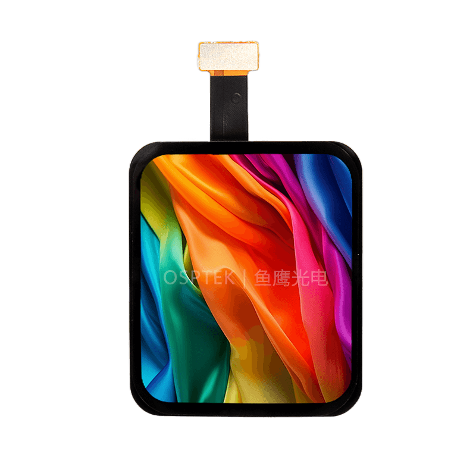

<h1 align="center">OSPTEK 1.6″ AMOLED 320×360（CO5300 · QSPI）</h1>

<b>AMOLED 模组 · QSPI · CO5300 · 多版本索引</b>

<a href="./README_EN.md">English</a> | 简体中文

  
  
  
  

## 目录

- [说明](#说明)
- [版本一览](#版本一览)
- [AM160Q320360ZS1](#am160q320360zs1)
- [AM160Q320360ZS（停产 / EOL）](#am160q320360zs)
- [购买链接](#购买链接)
- [技术支持](#技术支持)

---

## 说明

本仓库收录 **1.6 寸 320×360 AMOLED（QSPI · CO5300）** 显示模组资料。

**根目录 README 为导航页**。下表可快速浏览各版本；点击「完整资料」进入 `versions/` 下对应**料号文件夹**（产品页、规格书、示例均在该目录内）。

规格标识（仓库名）：`amoled-1.6-320x360-qspi-co5300`

---

## 版本一览

| 版本 | 宣传图 | 简介 | 完整资料 |
| ---- | ------ | ---- | -------- |
| AM160Q320360ZS1 |  | [简介](#am160q320360zs1) | [完整资料](./versions/AM160Q320360ZS1/) |
| AM160Q320360ZS（停产 / EOL） |  | [简介](#am160q320360zs) | [完整资料](./versions/AM160Q320360ZS/) |

---

## AM160Q320360ZS1

**说明：** 现货。盖板比停产料号 `AM160Q320360ZS` 大；其余相同，驱动 / 例程可沿用。带触摸（CST820）。

完整产品页、规格书与示例：[versions/AM160Q320360ZS1/](./versions/AM160Q320360ZS1/)

---

## AM160Q320360ZS

**说明：** **停产 / EOL。** 请改用同仓 [`AM160Q320360ZS1`](./versions/AM160Q320360ZS1/)（盖板更大，驱动 / 例程可沿用）。本目录资料保留。

完整产品页、规格书与示例：[versions/AM160Q320360ZS/](./versions/AM160Q320360ZS/)

---

## 购买链接

  
  &nbsp;&nbsp;
  

**国内（淘宝）**

- 店铺：[鱼鹰光电工厂店](https://shop110742373.taobao.com/)

**海外（AliExpress）**

- 店铺：[OSPTEK Official Store](https://www.aliexpress.com/store/1105701619)

---

## 技术支持

- 技术支持 / 产品咨询：<luyu@osptek.com>
- QQ 技术交流群：**985881096**
- 公司官网：<https://osptek.com/>
- 有任何问题，都可以在本仓库 Issues 中提问

---

© 2026 OSPTEK 鱼鹰光电 · 本仓库资料采用 CC BY 4.0 许可

